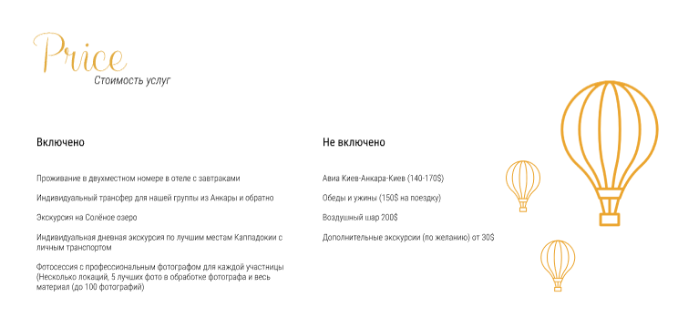
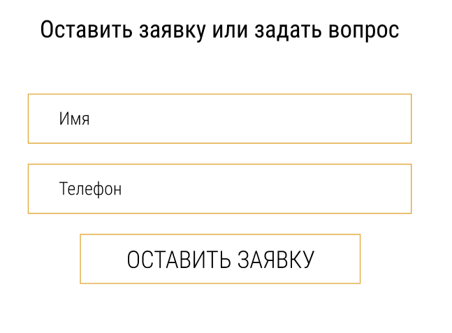
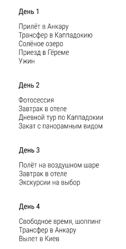

# БЭМ

## Задание 1

- глаз
  - глаз__правый
    - глаз__правый--красный
  - глаз__левый
    - глаз__левый--ушибленный
  - глаз__ресницы
    - глаз__ресницы--накладные
- нога
  - нога__левая
    - нога__левая--колено
  - нога__правая
    - нога__правая--колено
- рука
  - рука__левая
    - рука__левая--кисть
  - рука__правая
    - рука__правая--локоть

## Задание 2

### Навигация


```css
nav.nav>ul.nav__list>(li.nav__item*3>a.nav__link)+li.nav__item>a.nav__tel
```

### Стоимость



```css
section.price>h2.price__title+p.price__subtitle+.price__description.description*2>p.description__title+p.description__data
```

### Форма



```css
form.form>fieldset>legend+(label+input.form__input)*2+btn.form__btn
```

### Карточки



```css
.cards>.cards__card.card*4>p.card__title+p.card__date
```
